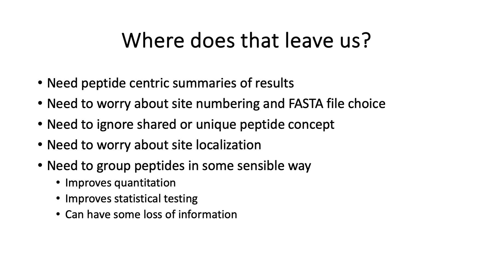

# PAW_phospho

Software for processing TMT-labeled phospho peptide enriched proteomics data processed with Proteome Discoverer 3.1 (specifically, the PSM export files).

## Background

Reversible phosphorylation is one of the most important regulatory biological processes. Mass spectrometry is an important technique for characterizing post-translational modifications like phosphorylation. PTMs can be identified and (sometimes) localized to specific residues in peptides from enzymatically digested proteins. Considerable effort over the past couple of decades has gone into techniques to enrich phospho peptides and configure the mass spectrometer to sequence phosphorylated peptides.

Enrichment is necessary because most PTMs, including phosphorylation, are substoichiometric (small numbers of modified proteins out of total protein). Phospho peptides are generally harder to detect than their unmodified counterparts. The phospho group (particularly for S and T residues) is labile and makes peptide fragmentation trickier. Collision energy can be dissipated by loss of the phospho group leaving insufficient energy for peptide bond cleavage.

Enrichment methods have matured and there are many kits and choices available. (This is not to say that efficient enrichment is trivial.) Much has been learned about better modes of fragmentation over the years for phosphorylated peptides and most mass specs have standard options now. Studying phosphorylation is a key area of proteomics and techniques for sample processing and mass spectrometry have advanced tremendously.

## The Problem

Unfortunately, data analysis methods for phospho peptide datasets have not kept pace. One can argue that they never really got there in the first place. Find any published proteomics paper studying phosphorylation and you will see the phospho peptides are identified with a tool/pipeline designed to report proteins. If you are interested in peptides, does it matter that the tool/pipeline is protein-centric? Yes, Virginia, there is a Santa Claus and you do not want to use protein-centric results for peptide-centric studies.

Protein inference and parsimony logic are critical steps in working backwards from the peptide digest (as determined by the sequenced peptides from the mass spec) to the (likely) proteins in the sample that could have give rise to those peptides. None of that applies to sets of enriched phospho peptides. Phosphorylation is (somewhat) specific (only at a few residues in a protein) and enrichment methods are very powerful (capable of pulling out very low abundance phospho peptides). Many phospho peptides will map to phospho proteins without any other peptide evidence. There is no information to drive protein inference algorithms.

The typical tools/pipelines first figure out the final protein list. This may involve a protein ranking function/heuristic and some attempt at protein false discovery rate control using target/decoy protein counting. Once the proteins are decided, tables of peptides and PSMs associated with the proteins in the final list are generated. Some tools/pipelines will also make a conditional PTM report. The important point is that any PSM, peptide, PTM reports are conditional. They will not include all PSMs that passed and PSM-level filtering. The protein inference, parsimony logic, protein identification criteria, and any protein FDR control will reject some PSMs. Some of the phospho peptides will be lost.

Phospho peptide experiments require peptide-centric results reporting. This might include some peptide grouping of quantitative measurements (less noise and fewer multiple tests to correct for), modification reports, site reports, site localizations, etc. No tools/pipelines do this - even after two decades of phosphorylation studies.   

## Poor data analysis practices are common

The fact that protein inference is completely irrelevant in phospho peptide studies and all phospho peptide studies are processed with tools/pipelines that are 100% dependent on protein inference should have been a **giant red flag**. How can it be that so many very smart folks for decades have not realized that their data analyses of phospho peptide data were fundamentally flawed? The short answer is that tool/pipeline failures are not catastrophic and common bad practices in tool design give the appearance that they work for peptide-centric data.

There are so many poor data analysis practices that are de facto standards in proteomics, it is hard to know where to start. All tools/pipelines are primarily designed to report parsimonious lists of inferred proteins. Protein identification criteria (minimum number of distinct peptides per protein being the most important here) and any protein FDR thresholds affect the final list of inferred proteins. The peptide and PTM reports commonly used in downstream statistical analyses of phospho peptides are conditioned on the final protein lists. Only the peptides and PTMs for the final list of proteins are reported.

### Single-peptide-per-protein identifications

What protein inference/criteria do most tools/pipelines adopt that lets most phospho peptides end up in the peptide and PTM tables? It is the abandonment of the "two peptide rule" for protein identification. This was the de facto standard for many years until [this paper](https://pubs.acs.org/doi/abs/10.1021/pr9004794) argued against the two-peptide rule.

> Even earlier, [ICAT (isotope coded affinity tags)](https://pubmed.ncbi.nlm.nih.gov/10504701/), a peptide-centric cysteine labeling and enrichment strategy produced data where single peptides were observed from proteins. The two-peptide rule was not good for these experiments. That is why the [ProteinProphet paper](http://tools.proteomecenter.org/publications/Nesvizhskii.AnalChem.03.pdf) was designed to report proteins with single peptides.

Rigorous mathematical arguments and practical heuristics are often a poor mix. Peptide sequencing errors do not have a simple relationship to protein identification errors. It is not a simple target/decoy counting exercise like PSM errors:

There is one-to-one relationship between PSM errors and protein errors when single peptide per protein results are allowed. A dataset of one hundred thousand MS2 scans with a 1% PSM error rate produces 1,000 incorrect PSMs that result in roughly 1,000 incorrect proteins. If we assume the data is from human and we have about 20,000 proteins in the canonical FASTA file, then 1,000 incorrect PSMs would give rise to about 25 incorrect proteins if two peptides per protein was required. For fun, if we required three peptides per protein, the estimated number of incorrect proteins would be less than one (0.4). The number of peptides per protein is a very powerful protein noise filter.

When there is poor understanding of the relationship between PSM errors and protein errors, an analogy to PSM FDR control is often used. PSM error control needs some scoring function to distinguish incorrect matches from correct matches. Some ad hoc protein scoring function must be constructed to distinguish confident protein IDs from less confident protein IDs. Common functions are sums of search engine scores, sums of some PSM probability, etc., where the PSMs have already undergone FDR filtering. This is basically just glorified spectral counting. The target and decoy proteins get ranked by these scores and protein FDR is computed analogously to PSM FDR via list traversals. That ranking mostly puts proteins with single peptides on the bottom, then proteins with two peptides, then proteins with three peptides, etc. The protein FDR trimming removes mostly single peptide proteins that had lower scoring PSMs. This process masquerades as a statistical analysis but is little more than a weighted "peptides per protein" rule.

That said, single peptide per protein identifications followed by some protein FDR analysis retains most PSMs and only kicks out some of the lowest scoring matches. The PSM loss is not great and largely goes un-noticed. However, all tools/pipelines probably have a minimum peptides per protein cutoff (usually defaulting to one) that can be set to higher values. Any setting other than one peptide per protein will have serious negative effects on phospho peptides. Tools/pipelines appearing to work for phospho peptides mostly do so completely by accident.

### Site numbers depend on the choice of protein sequences

When was the last time (maybe the fist time?) you read the Methods section of a phospho proteomics paper and there was any mention of how the protein sequences were selected so that the modified peptide site numbers reported by the search engine would facilitate comparison to literature and downstream databases (Uniprot.org, PhosphoSitePlus.org, PathwayCommons.org, etc.). Phosphorylation residues and site numbers have an implicit dependence on a single specific protein sequence. Do you know the full, exact protein sequence that was used to define a residue/position for a PTM in a publication or database resource?

It seems mind boggling to me that there is basically no discussion of protein sequence choice in phospho peptides studies that I have ever read. Amino acid residue and residue position counted from the N-terminus is how phospho sites are reported and tabulated. UniProt records have one protein sequence listed and modification sites are given in that protein sequence reference frame. Any alternatively spliced protein forms are described but no Swiss-Prot (the reviewed sequences) record lists sites in any alternative protein reference frames. Canonical sequences may or may not have initial Met residues that can cause off by one site number errors. Secreted proteins have signal peptides that are not present in the final protein forms but will probably have the signal peptide at the beginning of the FASTA sequence. There are also many mature proteins processed from longer protein sequences. What is the site numbering reference frame for those mature proteins?

An important part of solving problems is thinking them all the way through. If we do not ever talk about the protein reference frames for phospho site numbering, just how well has this problem been thought through? The is another red flag to me.

### Site localization is often impossible

Site localization algorithms are often (mis)used in phospho peptide studies. This is one of those "looks great on paper" versus "comes up short" in the field situations. Situations were site localization might work:

- peptides with one PTMs
- PTMs in the middle of the peptides
- possible sites in peptide are not adjacent residues
- peptides without co-eluting positional isomers

What is common in phospho peptide data?

- multiple phospho groups per peptide
- phospho sites close the peptide N- or C-terminus
- many S, T, or Y residues per peptide
- many adjacent S, T, or Y residues
- (maybe) co-eluting positional isomers

PTM work in proteomics is really hard. There are many assumptions in site localization algorithms and those assumptions are only met for a subset of the peptides. Treating site localization probabilities as rigorous computer values and invoking hard site localization probability cutoffs is not a smart thing to do. How well site localization works in "the wild" has not been proven well enough for me to trust using site localization as an upstream data filter. Another red flag is how often site localization probabilities are used to filter phospho peptide data.

## Quantitative testing of peptide-centric data

The above issues are related to identification of phospho peptides and reporting phospho peptide sites. Biological experiments involve comparing sample groups to see what phospho peptides are differentially abundant. Phospho peptide enrichment proteomics will run headlong into bottom-up quantitative proteomics. We need to think through how to summarize phospho peptide quantitative measurements for safer statistical testing.

Most quantitative proteomics data is noisy at the measurement level (individual scans) and benefits from averaging measurements (provided you don't average away biological effects). Peptides can have multiple charge states, more than one MS2 scan can be acquired from the same peptide, Met residues can be oxidized during sample handling, peptides can be present in more than one fraction (in fractionated samples), peptides can have phospho groups attached to different residues, and peptides can have different numbers of phospho groups. Combining multiple PSMs makes sense for most of these cases. I view site localization as not very robust, so combining PSMs when the phospho site is on different residues in the same peptide sequence also makes sense (to me). The total number of phospho groups in a protein region might have biological significance, so combining peptides that have different numbers of phospho groups might not be as okay. Combining as many PSMs as possible before statistical testing will reduce measurement noise and reduce the number of statistical tests (reducing effects of multiple testing corrections).    

## Summary of main concepts

*Slide 1*

Slide 1:

---

*Slide 2*

Slide 2:

---

*Slide 3*

Slide 3:

---

*Slide 4*

Slide 4:

---

*Slide 5*

Slide 5:

---

*Slide 6*

Slide 6:

---

## What `PD3.1_TMT_phospho_processer` script does

Proteome Discoverer (PD) v3.1 can be configured to provide phospho peptide PSM lists with TMT intensities and site localization information from ptmRS. Those PSM lists can be filtered by Percolator q-value to provide an appropriately small number of incorrect PSMs. PSMs can be combined to improve quantitation with some loss of site localization information. The large PD export tables can be simplified for easier biological interpretation.

PD SEQUEST setting are adjusted to provide better PSM ID rates (see below). Variable PTMs are set the minimum (phosphorylation at S, T, or Y and oxidation of Met). Some consensus workflow settings also need adjustment: protein ID criteria is one peptide per protein and the peptide and protein FDR settings in the consensus workflow are set to 0.99 to make sure all identified PSMs make it into the PSM results table.

> PD default parameters should not be assumed to be optimal in real world samples. For example, in SPS-MS3 TMT data where the ion trap is used for peptide IDs, the default SEQUEST settings mass tolerance setting of 10 PPM precursor and 0.6 Da fragment ion are not as good as 20 PPM and 1.0005 Da. A minimum peptide length of 7 instead of 6 should always be changed. The default reporter ion quantitative measure defaults to automatic (signal-to-noise ratio for Orbitraps) and should be set to "intensities" (reporter ion peak heights).

The script reads in a tab-delimited text version of the PSM results table and the protein FASTA file used in the SEQUEST search (for protein descriptions and to map peptide site numbers into protein site numbers). Other results tables from PD are irrelevant.

Peptide IDs are filtered to a user set q-value cutoff and delta mass window (variables set at the top of the Python script). If using a 20 PPM precursor tolerance, a +/- 10 PPM cutoff would be a good choice (depending on the instrument mass calibration). The q-value cutoff depends on the dataset size and how many PSMs are identified. For example, 50,000 PSMs at a q-value cutoff of 0.01 would result in 500 incorrect phospho peptides. More strict q-value cutoff may need to be set. The script has some console output that will list the final number of phosphorylated PSMs and an estimate of the number of incorrect matches. Q-value cutoff of 0.005 or 0.001 may be needed to get the final number of incorrect PSM down to an acceptable level.

In addition to the delta mass and q-value filters, non-phosphorylated peptides are excluded (they can be kept if desired). Enrichment methods may not be as specific for phosphorylated peptides as advertised. The filtered PSMs are written to a new PSM results table. PSMs and their reporter ion signals are combined. The combining algorithm uses the unmodified peptide sequence string and number of phospho groups as a combination key for PSM grouping. Information about what peptides were combined is also retained. A new PSM results table for combined peptides is produced. A simplified (only essential columns) combined PSM table is written for use in statistical testing notebooks.

The script lets the user browse to the PSM export file and browse to the FASTA sequence file. Any PSM filters are hard coded at the top of the script. The PSM results file parsing is not adaptive. It expects all of the default columns typically present in the PSM results table. The tab-delimited text output files written by the script use the base file name of the PD PSM export table and append some suffixes.

If you are interested in using this script, you might want to contact me by email for assistance.

---

Phil Wilmarth   PSR Core, OHSU   February 29, 2024
