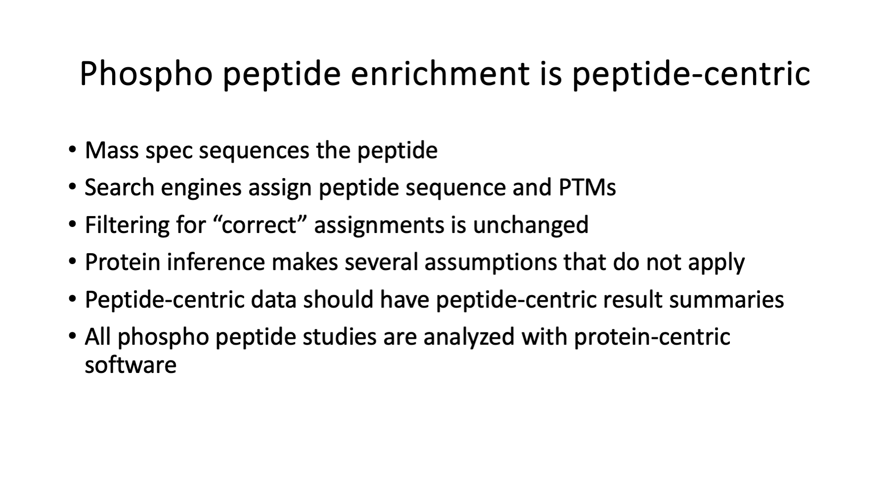

# PAW_phospho

Phospho peptide software for processing Proteome Discoverer PSM export files.

## Background (the Why)

Reversible phosphorylation is one of the most important regulatory biological processes. Mass spectrometry is an important technique for characterizing post-translational modifications like phosphorylation. PTMs can be identified and (sometimes) localized to specific residues in peptides from enzymatically digested proteins. Considerable effort over the past couple of decades has gone into techniques to enrich phospho peptides and configure the mass spectrometer to sequence phosphorylated peptides.

Enrichment is necessary because most PTMs, including phosphorylation, are substoichiometric (small numbers of modified proteins out of total protein). Phospho peptides are generally harder to detect than their unmodified counterparts. The phospho group (particularly for S and T residues) is labile and makes peptide fragmentation trickier. Collision energy can be dissipated by loss of the phospho group leaving insufficient energy for peptide bond cleavage.

Enrichment methods have matured and there are many kits and choices available. (This is not to say that efficient enrichment is trivial.) Much has been learned about better modes of fragmentation over the years for phosphorylated peptides and most mass specs have standard options now. Studying phosphorylation is a key area of proteomics and techniques for sample processing and mass spectrometry have advanced tremendously.

Unfortunately, data analysis methods for phospho peptide datasets have not kept pace. One can argue that they never really got there in the first place. Find any published proteomics paper studying phosphorylation and you will see the phospho peptides are identified with a tool/pipeline designed to report proteins. If you are interested in peptides, does it matter that the tool/pipeline is protein-centric? Yes, Virginia, there is a Santa Claus and you do not want to use protein-centric results for peptide-centric studies.

Protein inference and parsimony logic are critical steps in working backwards from the peptide digest (as determined by the sequenced peptides from the mass spec) to the (likely) proteins in the sample that could have give rise to those peptides. None of that applies to sets of enriched phospho peptides. Phosphorylation is (somewhat) specific (only at a few residues in a protein) and enrichment methods are very powerful (capable of pulling out very low abundance phospho peptides). Many phospho peptides will map to phospho proteins without any other peptide evidence. There is no information to drive protein inference algorithms.

The typical tools/pipelines first figure out the final protein list. This may involve a protein ranking function/heuristic and some attempt at protein false discovery rate control using target/decoy protein counting. Once the proteins are decided, tables of peptides and PSMs associated with the proteins in the final list are generated. Some tools/pipelines will also make a conditional PTM report. The important point is that any PSM, peptide, PTM reports are conditional. They will not include all PSMs that passed and PSM-level filtering. The protein inference, parsimony logic, protein identification criteria, and any protein FDR control will reject some PSMs. Some of the phospho peptides will be lost.

Phospho peptide experiments require peptide-centric results reporting. This might include some peptide grouping of quantitative measurements (less noise and fewer multiple tests to correct for), modification reports, site reports, site localizations, etc. No tools/pipelines do this, even after two decades of phosphorylation studies.   

## Bad data analysis practices are common

The fact that protein inference is completely irrelevant in phospho peptide studies and all phospho peptide studies are processed with tools/pipelines that are 100% dependent on protein inference should have been a **giant red flag**. How can it be that so many very smart folks for decades have not realized that their data analyses of phospho peptide data were fundamentally flawed? The short answer is that tool/pipeline failures are not catastrophic and common bad practices in tool design give the appearance that they work for peptide-centric data.

There are so many bad data analysis practices that are de facto standards in proteomics, it is hard to know where to start. All tools/pipelines are primarily designed to report parsimonious lists of inferred proteins. Protein identification criteria (minimum number of distinct peptides per protein being the most important here) and any protein FDR thresholds affect the final list of inferred proteins. The peptide and PTM reports commonly used in downstream statistical analyses of phospho peptides are conditioned on the final protein lists. Only the peptides and PTMs for the final list of proteins are reported.

  

## Summary
*Slide 1*

Slide 1:

---

*Slide 2*

Slide 2:

---

*Slide 3*

Slide 3:

---

*Slide 4*

Slide 4:

---

*Slide 5*

Slide 5:

---

*Slide 6*

Slide 6:

---
